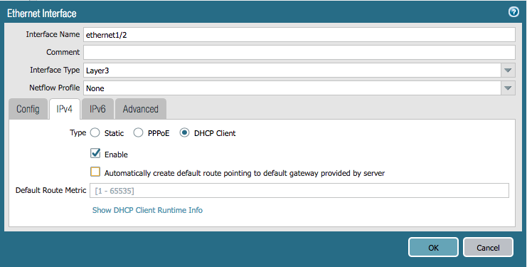
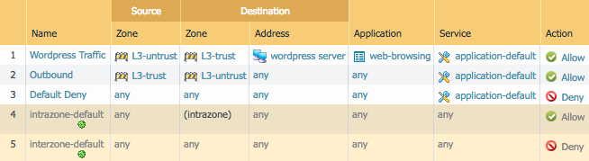

# Ansible Lab Activities

## Task 1 - Lab Setup

Change into the `ansible` directory.  We'll use it for all of our Ansible files.

```bash
$ cd ../ansible
```

Then, install the Palo Alto Networks Ansible Galaxy role:

```bash
$ sudo ansible-galaxy install PaloAltoNetworks.paloaltonetworks
```

---

## Task 2 - Basic Network Config

Using a text editor such as **vim**, **emacs**, or **nano** edit the file called `inventory`.  This file will contains a list of hosts that Ansible will communicate with during execution.

Replace the value `127.0.0.1` with the external IP address of your VM-Series instance.

```yml
[fw]
127.0.0.1
```

Next, create the file `fw_vars.yml` and add the following valiables.  Fill in the blanks with the appropriate values from your VM-Series instance.

```yml
ip_address: ''
username: ''
password: ''
```

Now, create the file `network.yml`.  This will be the playbook that holds the low level networking config for our firewall.

Each playbook needs the following header information to pull in the variables we just defined.  Add the following to `network.yml`:

```yml
- name: SKO2019 Ansible Playbook
  hosts: fw
  connection: local
  gather_facts: false

  roles:
    - role: PaloAltoNetworks.paloaltonetworks

  tasks:
  - name: Grab auth creds
    include_vars: 'fw_vars.yml'
    no_log: 'yes'
```

### Network Interfaces & Zones

We're going to create the exact same configuration with Ansible as we did with Terraform.  Here are screenshots of the network interfaces and zones we need to create:





Add the following to `network.yml`:

```yml
  tasks:
  - name: Grab auth creds
    include_vars: 'fw_vars.yml'
    no_log: 'yes'

  - name: "Configure eth1/1"
    panos_interface:
      ip_address: '{{ ip_address }}'
      username: '{{ username }}'
      password: '{{ password }}'
      if_name: 'ethernet1/1'
      create_default_route: true
      zone_name: 'L3-trust'
      commit: False

  - name: "Configure eth1/2"
    panos_interface:
      ip_address: '{{ ip_address }}'
      username: '{{ username }}'
      password: '{{ password }}'
      if_name: 'ethernet1/2'
      zone_name: 'L3-untrust'
      commit: False
```

Refer to the [module
documentation](http://panwansible.readthedocs.io/en/latest/modules/panos_interface_module.html)
for ethernet interfaces if you need.

Note that Ansible is a little different from Terraform.  We have to specify the **ip_address**, **username**, and **password** each time because each module executes independently.  Also, we don't have to create the zones as a separate step because they will be created for us if they don't exist.

### Run the Playbook

Your final, full `network.yml` playbook should look like this:

```yml
- name: SKO2019 Ansible Playbook
  hosts: fw
  connection: local
  gather_facts: false

  roles:
    - role: PaloAltoNetworks.paloaltonetworks

  tasks:
  - name: Grab auth creds
    include_vars: 'fw_vars.yml'
    no_log: 'yes'

  - name: "Configure eth1/1"
    panos_interface:
      ip_address: '{{ ip_address }}'
      username: '{{ username }}'
      password: '{{ password }}'
      if_name: 'ethernet1/1'
      create_default_route: true
      zone_name: 'L3-trust'
      commit: False

  - name: "Configure eth1/2"
    panos_interface:
      ip_address: '{{ ip_address }}'
      username: '{{ username }}'
      password: '{{ password }}'
      if_name: 'ethernet1/2'
      zone_name: 'L3-untrust'
      commit: False
```

Run your playbook with the following command:

```bash
$ ansible-playbook -i inventory network.yml
```

Log in to the GUI of your firewall and verify that the configuration matches what you want.  Because we specified `commit: False` for each module call in our playbook, the changes have only been made to the candidate configuration and have **not** been committed.

If you get errors, indentation is most likely the problem.  Once you fix any errors, run the playbook again and the firewall should now have your desired config.

---

## Task 3 - Objects and Security Rule Creation

Now we will create the same address object and security rules as in the Terraform portion.  Create a new file `rules.yml`, and copy in the header information from the network config steps:

```yml
- name: SKO2019 Ansible Playbook
  hosts: fw
  connection: local
  gather_facts: false

  roles:
    - role: PaloAltoNetworks.paloaltonetworks

  tasks:
  - name: Grab auth creds
    include_vars: 'fw_vars.yml'
    no_log: 'yes'
```

Here is the address object we need to create:


Add the following to `rules.yml`:

```yml
  - name: "Add address object for wordpress server"
    panos_object:
      ip_address: '{{ ip_address }}'
      username: '{{ username }}'
      password: '{{ password }}'
      operation: 'add'
      addressobject: 'wordpress server'
      address: '10.1.23.45'
      description: 'Internal server'
      commit: false
```

Refer to the [module
documentation](http://panwansible.readthedocs.io/en/latest/modules/panos_object_module.html)
for address objects if you need.

Here are the security rules we need to create:



Add the following to `rules.yml`:

```yml
  - name: "Add Wordpress Traffic rule"
    panos_security_rule:
      ip_address: '{{ ip_address }}'
      username: '{{ username }}'
      password: '{{ password }}'
      operation: 'add'
      rule_name: 'Wordpress Traffic'
      source_zone: ['L3-untrust']
      destination_zone: ['L3-trust']
      destination_ip: ['wordpress server']
      application: ['web-browsing']
      action: 'allow'
      commit: false

  - name: "Add Outbound rule"
    panos_security_rule:
      ip_address: '{{ ip_address }}'
      username: '{{ username }}'
      password: '{{ password }}'
      operation: 'add'
      rule_name: 'Outbound'
      source_zone: ['L3-trust']
      destination_zone: ['L3-untrust']
      action: 'allow'
      commit: false

  - name: "Add Default Deny rule"
    panos_security_rule:
      ip_address: '{{ ip_address }}'
      username: '{{ username }}'
      password: '{{ password }}'
      operation: 'add'
      rule_name: 'Default Deny'
      action: 'deny'
      commit: false
```

### Run the Playbook

Your final, full `rules.yml` playbook should look like this:

```yml
- name: SKO2019 Ansible Playbook
  hosts: fw
  connection: local
  gather_facts: false

  roles:
    - role: PaloAltoNetworks.paloaltonetworks

  tasks:
  - name: Grab auth creds
    include_vars: 'fw_vars.yml'
    no_log: 'yes'

  - name: "Add address object for wordpress server"
    panos_object:
      ip_address: '{{ ip_address }}'
      username: '{{ username }}'
      password: '{{ password }}'
      operation: 'add'
      addressobject: 'wordpress server'
      address: '10.1.23.45'
      description: 'Internal server'
      commit: false

  - name: "Add Wordpress Traffic rule"
    panos_security_rule:
      ip_address: '{{ ip_address }}'
      username: '{{ username }}'
      password: '{{ password }}'
      operation: 'add'
      rule_name: 'Wordpress Traffic'
      source_zone: ['L3-untrust']
      destination_zone: ['L3-trust']
      destination_ip: ['wordpress server']
      application: ['web-browsing']
      action: 'allow'
      commit: false

  - name: "Add Outbound rule"
    panos_security_rule:
      ip_address: '{{ ip_address }}'
      username: '{{ username }}'
      password: '{{ password }}'
      operation: 'add'
      rule_name: 'Outbound'
      source_zone: ['L3-trust']
      destination_zone: ['L3-untrust']
      action: 'allow'
      commit: false

  - name: "Add Default Deny rule"
    panos_security_rule:
      ip_address: '{{ ip_address }}'
      username: '{{ username }}'
      password: '{{ password }}'
      operation: 'add'
      rule_name: 'Default Deny'
      action: 'deny'
      commit: false
```

Run your playbook with the following command:

```bash
$ ansible-playbook -i inventory rules.yml
```

Log in to the GUI of your firewall and verify that the configuration matches what you want.  Remember that your changes haven't been committed, and if you get errors, indentation is most likely the problem.

You're done with the Ansible portion of the lab.
