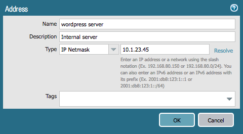

# Ansible Lab Activities

In this activity you will:

* Set up the initial configuration files
* Perform basic network configuration
* Create objects and security rules

## Task 1 - Lab Setup

Change into the `ansible` directory.  We'll use it for all of our Ansible files.

```bash
$ cd ../ansible
```

Then, install the Palo Alto Networks Ansible Galaxy role:

```bash
$ sudo ansible-galaxy install PaloAltoNetworks.paloaltonetworks
```

---

## Task 2 - Basic Network Config

Edit the file called `inventory` with your text editor.  This file will contains a list of hosts and host groups that Ansible will communicate with during execution.

Fill in the blank `ip_address` value with the external IP address of your VM-Series instance.

```yml
---
all:
  hosts:
    fw:
      ansible_host: '127.0.0.1'
      ip_address: ''
```

Next, edit the file `vars.yml` and fill in the blank values with the appropriate values from your VM-Series instance.

```yml
---
username: ''
password: ''
```
---
**NOTE:** It's a very poor security practice to store administrative credentials in cleartext files.  We're only doing so in this lab for the sake of simplicity. Normally, you would want to use Ansible's Vault functionality to encrypt sensitive variables and decrypt them when playbooks are being run.  More information on Ansible Vault may be found [here](https://docs.ansible.com/ansible/2.6/user_guide/vault.html).

---

Now, create the file `network.yml`.  This will be the playbook that holds the low level networking config for our firewall.

Each playbook needs the following header information to pull in the variables we just defined.  Add the following to `network.yml`:

```yml
- name: Ansible Playbook
  hosts: fw
  connection: local
  gather_facts: false

  roles:
    - role: PaloAltoNetworks.paloaltonetworks

  tasks:
  - name: Grab auth creds
    include_vars: 'vars.yml'
    no_log: 'yes'
```

---
**NOTE:** Ansible configuration files utilize a format known as YAML (Yet Another Markup Language). Spacing is *very* important when editing YAML files.  Please be sure when copying and pasting to include all spacing as well.  All of the task names and parameters should line up properly.

---

### Network Interfaces & Zones

We're going to recreate the same configuration from the Terraform lab in Ansible.  Here are examples of the network interfaces and zones we need to create:


Add the following to `network.yml`:

```yml
  - name: "Configure eth1/1"
    panos_interface:
      ip_address: '{{ ip_address }}'
      username: '{{ username }}'
      password: '{{ password }}'
      if_name: 'ethernet1/1'
      create_default_route: true
      zone_name: 'L3-trust'
      commit: False

  - name: "Configure eth1/2"
    panos_interface:
      ip_address: '{{ ip_address }}'
      username: '{{ username }}'
      password: '{{ password }}'
      if_name: 'ethernet1/2'
      zone_name: 'L3-untrust'
      commit: False
```

Refer to the [module documentation](http://panwansible.readthedocs.io/en/latest/modules/panos_interface_module.html) for details on the `panos_ethernet` module.

Note that Ansible is a little different from Terraform.  We have to specify the **ip_address**, **username**, and **password** each time because each module executes independently.  Also, we don't have to create the zones as a separate step because they will be created for us if they don't exist.

### Run the Playbook

The resulting `network.yml` playbook should look like this:

```yml
- name: My Ansible Playbook
  hosts: fw
  connection: local
  gather_facts: false

  roles:
    - role: PaloAltoNetworks.paloaltonetworks

  tasks:
  - name: Grab auth creds
    include_vars: 'vars.yml'
    no_log: 'yes'

  - name: Configure eth1/1
    panos_interface:
      ip_address: '{{ ip_address }}'
      username: '{{ username }}'
      password: '{{ password }}'
      if_name: 'ethernet1/1'
      create_default_route: true
      zone_name: 'L3-trust'
      commit: False

  - name: Configure eth1/2
    panos_interface:
      ip_address: '{{ ip_address }}'
      username: '{{ username }}'
      password: '{{ password }}'
      if_name: 'ethernet1/2'
      zone_name: 'L3-untrust'
      commit: False
```

Run your playbook with the following command:

```bash
$ ansible-playbook -i inventory network.yml
```

Log in to the GUI of your firewall and verify that the configuration matches the examples above.  Because we specified `commit: False` for each module call in our playbook, the changes have only been made to the candidate configuration and have **not** been committed.

If you get errors, indentation is most likely the problem.  Once you fix any errors, run the playbook again and the firewall should now have your desired config.

---

## Task 3 - Objects and Security Rule Creation

Create a new file `rules.yml`, and add the same header information from the network config task.

```yml
- name: SKO2019 Ansible Playbook
  hosts: fw
  connection: local
  gather_facts: false

  roles:
    - role: PaloAltoNetworks.paloaltonetworks

  tasks:
  - name: Grab auth creds
    include_vars: 'vars.yml'
    no_log: 'yes'
```

Here is an example of the address object we will create:



Add the following to `rules.yml`:

```yml
  - name: Add address object for WordPress server
    panos_object:
      ip_address: '{{ ip_address }}'
      username: '{{ username }}'
      password: '{{ password }}'
      operation: 'add'
      addressobject: 'WordPress server'
      address: '10.1.23.45'
      description: 'Internal server'
```

Refer to the [module documentation](http://panwansible.readthedocs.io/en/latest/modules/panos_object_module.html) for more details on the `panos_object` module.

Here is an example of the security rules we will create:


Add the following to `rules.yml`:

```yml
  - name: Add WordPress Traffic rule
    panos_security_rule:
      ip_address: '{{ ip_address }}'
      username: '{{ username }}'
      password: '{{ password }}'
      operation: 'add'
      rule_name: 'WordPress Traffic'
      source_zone: ['L3-untrust']
      destination_zone: ['L3-trust']
      destination_ip: ['WordPress server']
      application: ['web-browsing']
      action: 'allow'
      commit: False

  - name: Add Outbound rule
    panos_security_rule:
      ip_address: '{{ ip_address }}'
      username: '{{ username }}'
      password: '{{ password }}'
      operation: 'add'
      rule_name: 'Outbound'
      source_zone: ['L3-trust']
      destination_zone: ['L3-untrust']
      action: 'allow'
      commit: False

  - name: Add Default Deny rule
    panos_security_rule:
      ip_address: '{{ ip_address }}'
      username: '{{ username }}'
      password: '{{ password }}'
      operation: 'add'
      rule_name: 'Default Deny'
      action: 'deny'
      commit: False
```

Refer to the [module documentation](http://panwansible.readthedocs.io/en/latest/modules/panos_security_rule_module.html) for more details on the `panos_security_rule` module.

### Run the Playbook

Your final, full `rules.yml` playbook should look like this:

```yml
- name: My Ansible Playbook
  hosts: fw
  connection: local
  gather_facts: false

  roles:
    - role: PaloAltoNetworks.paloaltonetworks

  tasks:
  - name: Grab auth creds
    include_vars: 'vars.yml'
    no_log: 'yes'

  - name: Add address object for WordPress server
    panos_object:
      ip_address: '{{ ip_address }}'
      username: '{{ username }}'
      password: '{{ password }}'
      operation: 'add'
      addressobject: 'WordPress server'
      address: '10.1.23.45'
      description: 'Internal server'

  - name: Add WordPress Traffic rule
    panos_security_rule:
      ip_address: '{{ ip_address }}'
      username: '{{ username }}'
      password: '{{ password }}'
      operation: 'add'
      rule_name: 'WordPress Traffic'
      source_zone: ['L3-untrust']
      destination_zone: ['L3-trust']
      destination_ip: ['WordPress server']
      application: ['web-browsing']
      action: 'allow'
      commit: False

  - name: Add Outbound rule
    panos_security_rule:
      ip_address: '{{ ip_address }}'
      username: '{{ username }}'
      password: '{{ password }}'
      operation: 'add'
      rule_name: 'Outbound'
      source_zone: ['L3-trust']
      destination_zone: ['L3-untrust']
      action: 'allow'
      commit: False

  - name: Add Default Deny rule
    panos_security_rule:
      ip_address: '{{ ip_address }}'
      username: '{{ username }}'
      password: '{{ password }}'
      operation: 'add'
      rule_name: 'Default Deny'
      action: 'deny'
      commit: False
```

Run your playbook with the following command:

```bash
$ ansible-playbook -i inventory rules.yml
```

Log in to the web UI of the firewall and verify that the configuration matches the examples above.  Remember that your changes haven't been committed.  If you get errors indentation is most likely the problem.

You're done with the Ansible portion of the lab.
