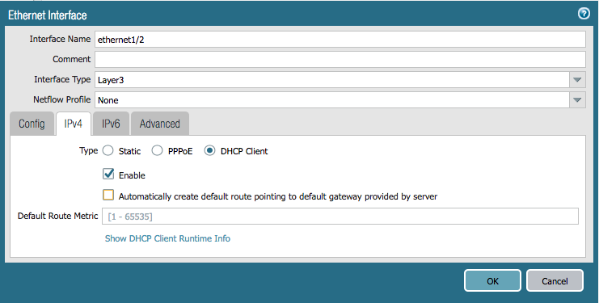
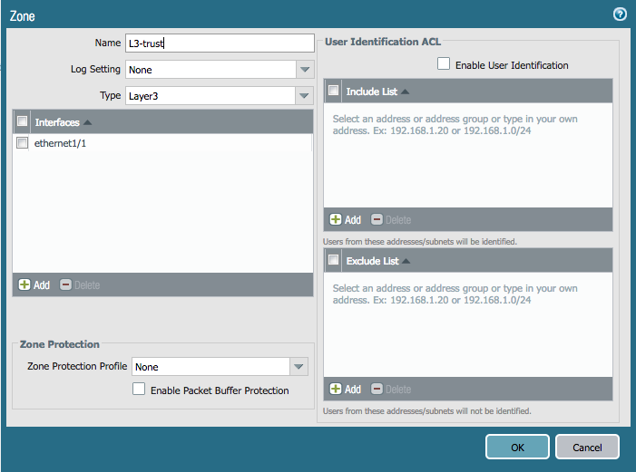

# Terraform Guided Example

In this guided example, we're going to walk through creating basic networking
for subsequent configuration to make use of.

Create the following:

* ethernet1/1 as DHCP in a zone named "L3-trust"
* ethernet1/2 as DHCP in a zone named "L3-untrust"


## Basic Config

Find or create an empty directory, making it the current working directory, as
we'll use it for all of our Terraform files.

Open a text editor (e.g. - `vi`, `emacs`, `nano`, `notepad.exe`) and let's
start with defining our provider config, which will be using the `panos`
provider:

```hcl
provider "panos" {
}
```

As we learned in the Terraform basics section, we'll first need to configure
the provider and point it at our firewall.  Referring to the [provider argument
reference](https://www.terraform.io/docs/providers/panos/index.html#argument-reference),
we see that we need a hostname, username, and password for the PAN-OS we want
to automate against.  So let's add that in, and now our provider block should look
like this, except you should put your real PAN-OS IP address and authentication
credentials in instead:

```hcl
provider "panos" {
    hostname = "127.0.0.1"
    username = "admin"
    password = "admin"
}
```


## Ethernet Interfaces

Let's create the ethernet interfaces next.  Here's pictures of the ethernet
interfaces that we need to create:




[Here is the
documentation](https://www.terraform.io/docs/providers/panos/r/ethernet_interface.html)
for ethernet interfaces.  Looking at the docs, we see that the resource is
named `panos_ethernet_interface`, so let's go ahead and add that to our plan
file so far.  I'll name my resource "eth1" for simplicity:

```hcl
resource "panos_ethernet_interface" "eth1" {
}
```

We want to configure ethernet1/1, so let's add that next:

```hcl
resource "panos_ethernet_interface" "eth1" {
    name = "ethernet1/1"
}
```

Next, we want it in vsys1, so add that in:

```hcl
resource "panos_ethernet_interface" "eth1" {
    name = "ethernet1/1"
    vsys = "vsys1"
}
```

We want it to be a layer3 interface, so add that in now:

```hcl
resource "panos_ethernet_interface" "eth1" {
    name = "ethernet1/1"
    vsys = "vsys1"
    mode = "layer3"
}
```

Now, we want it to be a DHCP interface, and create the DHCP default
route, so put those two in now:

```hcl
resource "panos_ethernet_interface" "eth1" {
    name = "ethernet1/1"
    vsys = "vsys1"
    mode = "layer3"
    enable_dhcp = true
    create_dhcp_default_route = true
}
```

With that, our ethernet1/1 configuration is now done!  We also need to
configure ethernet1/2, but the steps are the same.  Following the same steps
but just omiting the DHCP default route creation, the second interface config
should look like this:

```hcl
resource "panos_ethernet_interface" "eth2" {
    name = "ethernet1/2"
    vsys = "vsys1"
    mode = "layer3"
    enable_dhcp = true
}
```


## Zones

Finally, we need to place our two ethernet interfaces into their respective
zones:  eth1/1 into L3-trust, and eth1/2 into L3-untrust.

Here are the two zones we need to configure:




Looking over [the ethernet interface
documentation](https://www.terraform.io/docs/providers/panos/r/ethernet_interface.html),
we don't see any mention of how to put these interfaces into zones.  However,
there is a
[zone resource](https://www.terraform.io/docs/providers/panos/r/zone.html),
so go there now and take a few minutes to read the documentation.

After reading over the documentation, we now know that the zone will be
referencing the interface, not the other way around.  So let's build our config
up bit by bit, just like last time.

We'll start with the name of the resource, I'll call mine "int" for "internal"
for the L3-trust zone:

```hcl
resource "panos_zone" "int" {
}
```

The name should be "L3-trust", so add that in:

```hcl
resource "panos_zone" "int" {
    name = "L3-trust"
}
```

It's a layer3 zone, just like the interface, so add that next:

```hcl
resource "panos_zone" "int" {
    name = "L3-trust"
    mode = "layer3"
}
```

Finally, we need to put ethernet1/1 into this zone, but we need to do this
properly.  This is a dependency, because we want the interface to be created
first so that the zone can properly reference it.  So let's insert an
attribute variable to tell Terraform that the interface would need to be made
first.  Remember that the format of attribute variables is the full path to
the attribute.  So our config for the resource should look like this now:

```hcl
resource "panos_zone" "int" {
    name = "L3-trust"
    mode = "layer3"
    interfaces = ["${panos_ethernet_interface.eth1.name}"]
}
```

Now, we just need to do the same thing for our L3-untrust zone.  Follow the
same steps and create the second zone.  I'll name my second zone "ext" for
"external", but the config should look like this:

```hcl
resource "panos_zone" "ext" {
    name = "L3-untrust"
    mode = "layer3"
    interfaces = ["${panos_ethernet_interface.eth2.name}"]
}
```

Your final, full plan file should look something like this:

```hcl
provider "panos" {
    hostname = "127.0.0.1"
    username = "admin"
    password = "admin"
}

resource "panos_ethernet_interface" "eth1" {
    name = "ethernet1/1"
    vsys = "vsys1"
    mode = "layer3"
    enable_dhcp = true
    create_dhcp_default_route = true
}

resource "panos_ethernet_interface" "eth2" {
    name = "ethernet1/2"
    vsys = "vsys1"
    mode = "layer3"
    enable_dhcp = true
}

resource "panos_zone" "int" {
    name = "L3-trust"
    mode = "layer3"
    interfaces = ["${panos_ethernet_interface.eth1.name}"]
}

resource "panos_zone" "ext" {
    name = "L3-untrust"
    mode = "layer3"
    interfaces = ["${panos_ethernet_interface.eth2.name}"]
}
```

Let's check our config for errors.  Like you've already learned from the
basics section, you need to run `terraform init` first to download all
providers your plan file makes use of.  So let's do that then check our config
with `terraform plan`:

```bash
$ terraform init
$ terraform plan
```

If there are no errors, go ahead and push your config updates the firewall:

```bash
$ terraform apply
```
