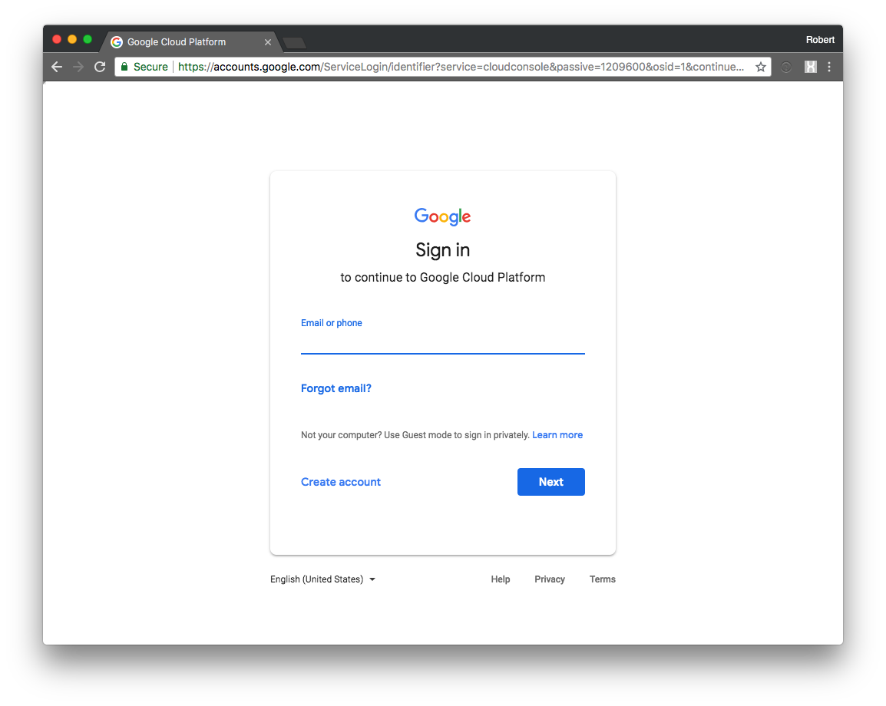
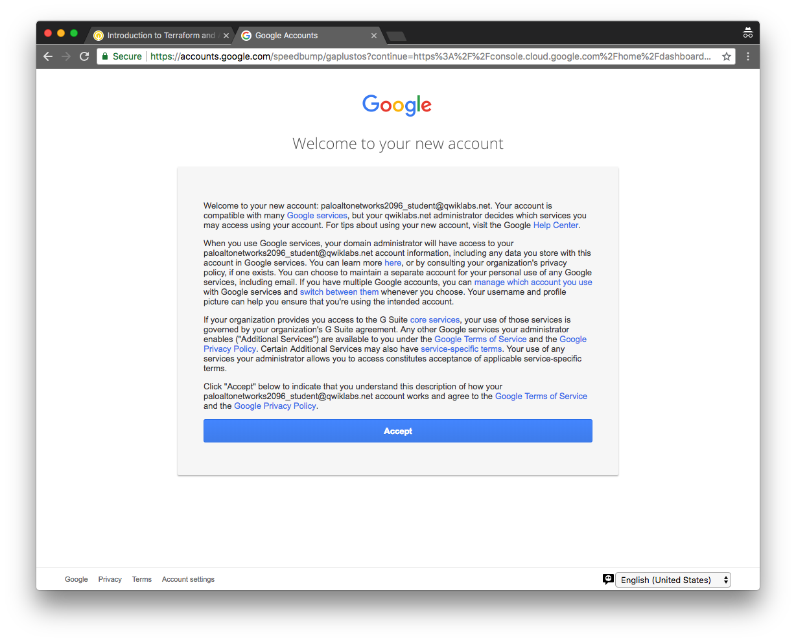
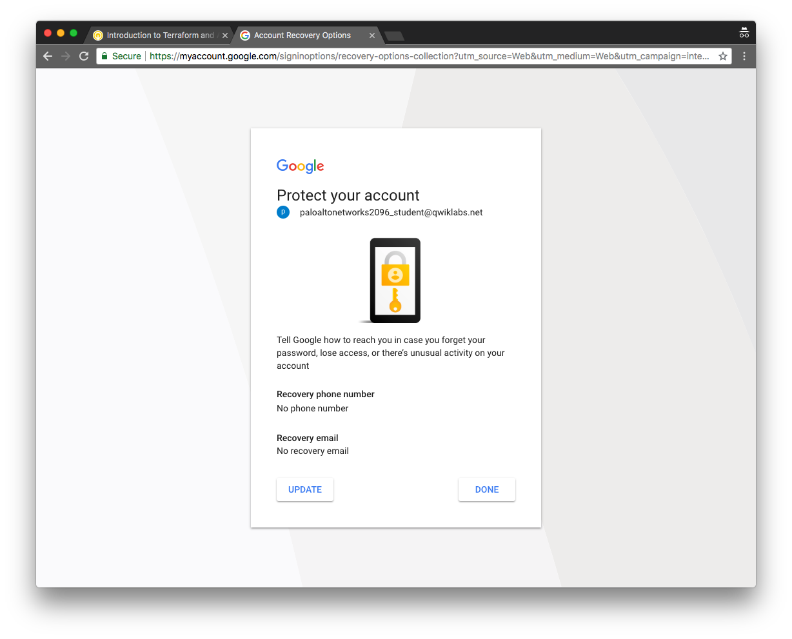
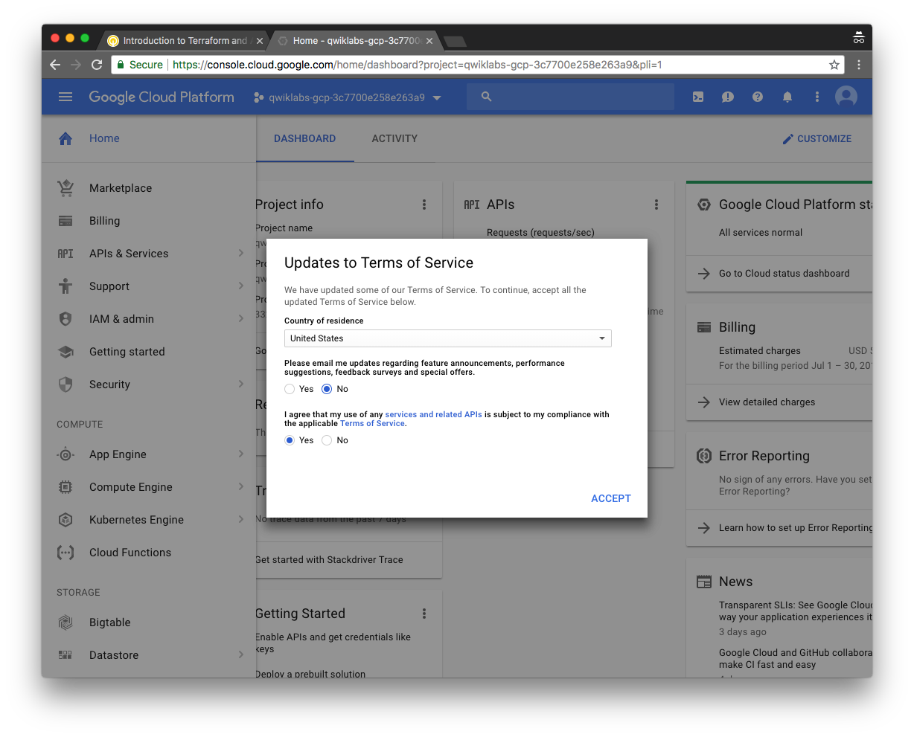
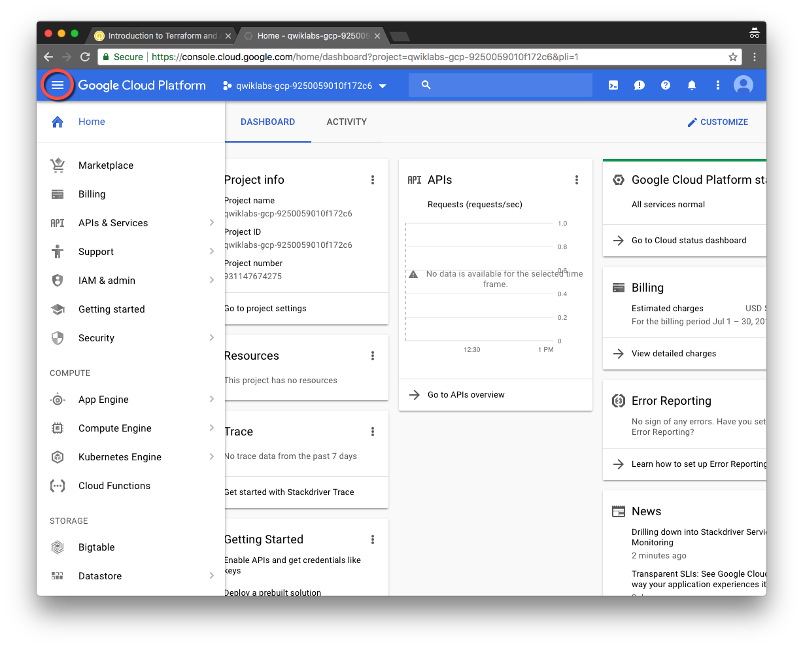
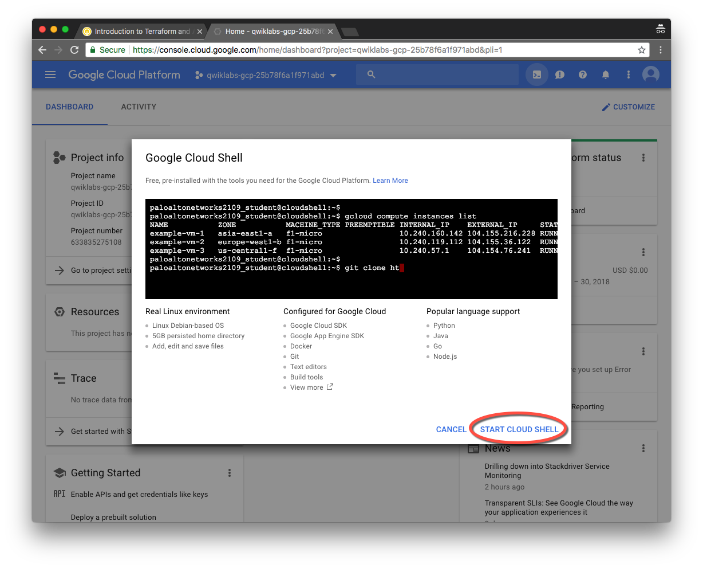
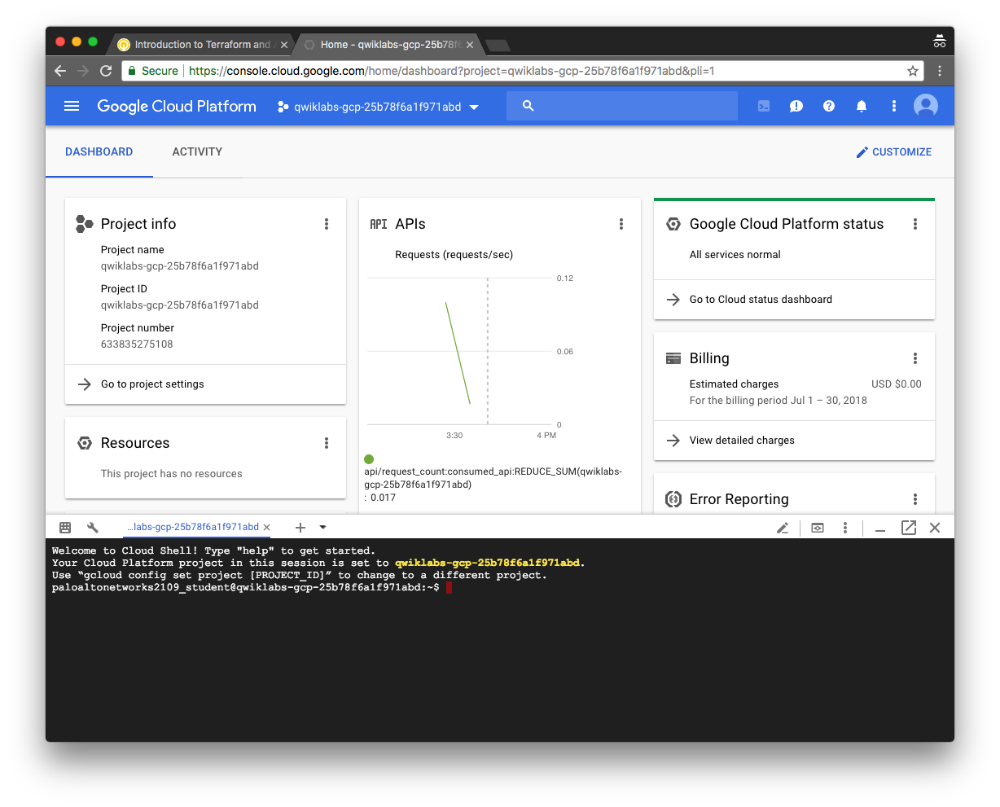
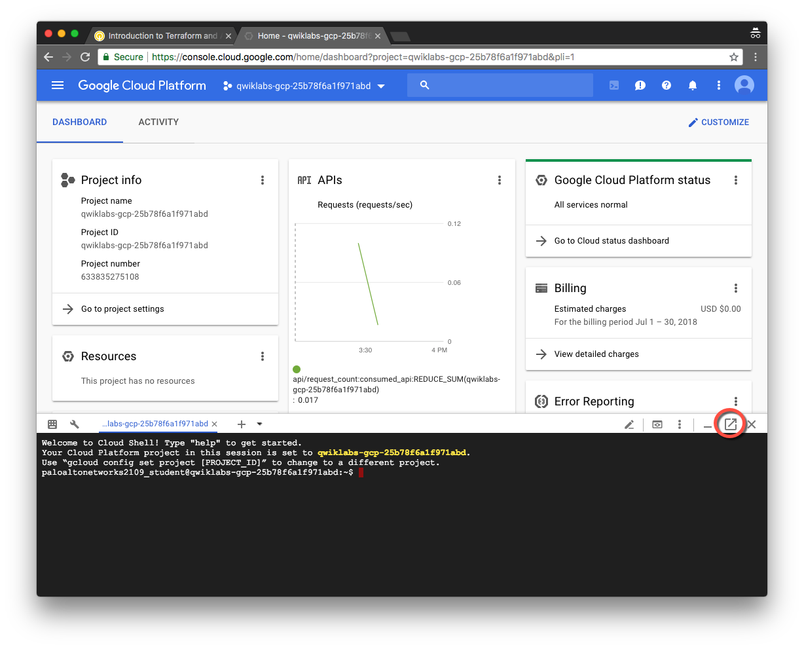
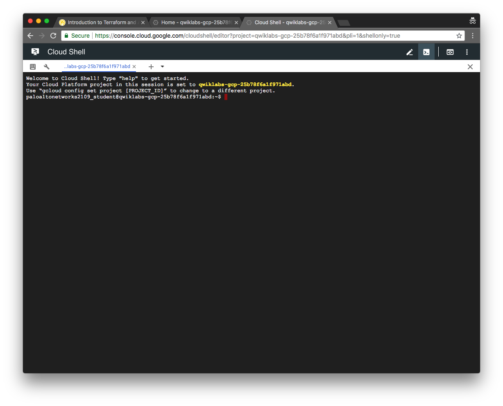

# Getting Started

In this activity you will:

* Log into Google Cloud Platform
* Launch the Google Cloud Shell
* Create a new GCP project

## Log into Google Cloud Platform

Using your web browser, navigate to [https://console.cloud.google.com](https://console.cloud.google.com).

Log in using your Google Cloud Platform credentials.  If you do not have a GCP account you can create one at [https://cloud.google.com/free](https://cloud.google.com/free).


Click __Accept__ on the logon banner page to accept the Terms of Service. *(New accounts only)*


Update your account recovery details and click __Done__. *(New accounts only)*


Select your country, opt out of email updates, and accept the updated Terms of Service and click __Accept__. *(New accounts only)*


## Launch Google Cloud Shell

Click the menu icon in the upper left-hand corner of the Dashboard to hide the sidebar menu.


In the upper right-hand corner of the Dashboard, click on the Cloud Shell icon.


A welcome page is displayed when launching the Cloud Shell for the first time. Click __Start Cloud Shell__ to proceed.


The Cloud Shell will appear at the bottom of the Dashboard.  Wait a few moments as it provisions and connects to the environment.


You can click on the __Open in New Window__ icon in the Cloud Shell toolbar for a full-sized Cloud Shell display in a new browser tab.


You are now ready to use the Cloud Shell.



## Create a new GCP project

In the Cloud Shell window, create a new project using the following `gcloud projects` command.

```bash
$ gcloud projects create terraform-ansible-lab
```

Then we'll need to change the GCP configuration to utilize this project with the following `gcloud config` command.

```bash
$ gcloud config set project terraform-ansible-lab
```

Confirm the configuration details with the following `gcloud config` command.

```bash
$ gcloud config list
```
