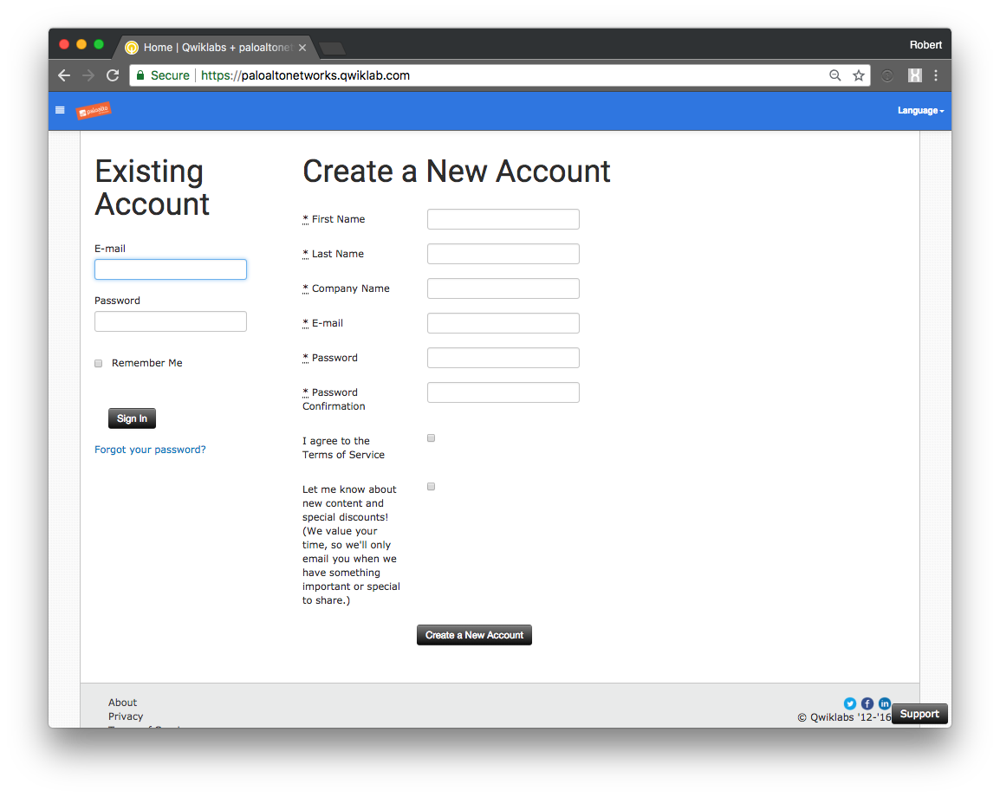
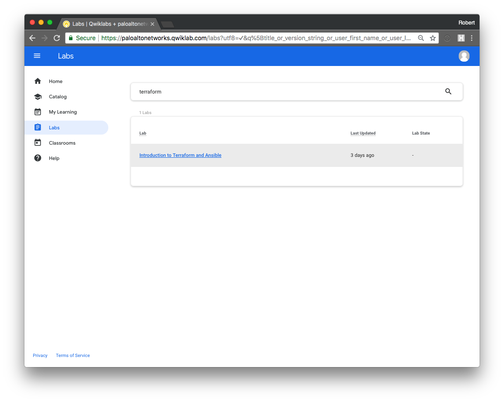
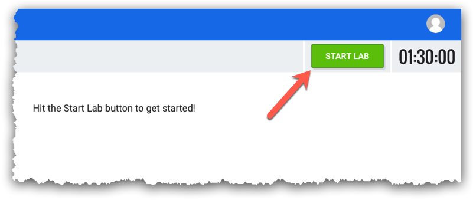
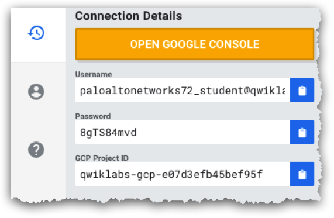

# Getting Started

In this activity you will:

* Launch the lab in Qwiklabs
* Launch the Google Cloud Shell

---
**NOTE:** If you are logged into any Google applications your personal credentials will be used rather than those provided by Qwiklabs when launching the GCP console.  You should either log out of Google entirely before proceeding or launch a private instance of your web browser.

---

## Log into Qwiklabs

1. Navigate to the Qwiklabs URL in your web browser

        https://paloaltonetworks.qwiklab.com

2. Sign up for a Qwiklabs account (if you don't have one already).
3. Log in with your Qwiklabs credentials.

## Launch the lab

1. Click on __Labs__ in the left-hand navigation menu.
2. Type the word `terraform` in the search bar and hit RETURN.
3. Click on __Introduction to Terraform and Ansible__ lab.

4. Click on __Start Lab__ in the upper right corner of the main lab page.

5. Make note of the __Username__, __Password__, and __GCP Project ID__.

## Log into Google Cloud Platform

1. Click on __Open Google Console__.  A new browser tab will open and take you to the Google login page.
2. Log in using the credentials from the main lab page.

3. Accept the terms and conditions.
4. Since this is a temporary lab account you can skip adding account recovery options and opt out of free trials.

## Launch Google Cloud Shell

1. In the upper right-hand corner of the Dashboard, click on the Cloud Shell icon.

2. The Cloud Shell will appear at the bottom of the Dashboard.  Wait a few moments as it provisions and connects to the environment.
3. You can click on __Open in New Window__ in the Cloud Shell toolbar for a full-sized Cloud Shell display in a new browser tab .

4. You are now ready to proceed with the lab configuration.

