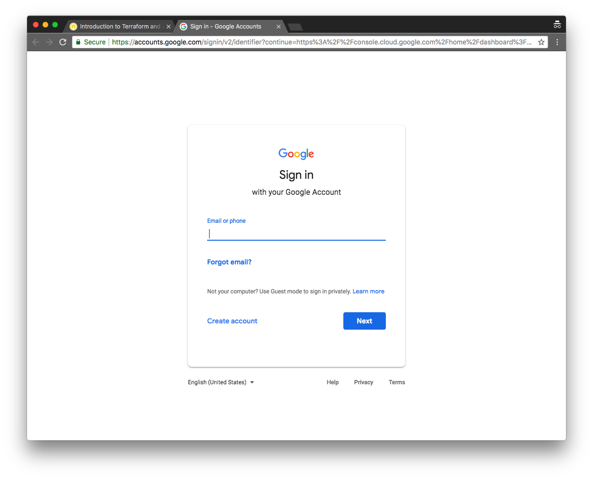

# Getting Started

In this activity you will:

* Log into Qwiklabs
* Launch the lab in Qwiklabs
* Create a Linux VM instance
* SSH into the Linux VM

---
**WARNING:** You must use the credentials provided by Qwiklabs for this lab.  Failure to do so may result in charges to your personal Google account.  You should either log out of Google entirely before proceeding or open an Icognito window in the Google Chrome web browser.


---

## Log into Qwiklabs

Navigate to the [Qwiklabs URL](https://paloaltonetworks.qwiklab.com) in your web browser

```html
https://paloaltonetworks.qwiklab.com
```

Log in with your Qwiklabs credentials (sign up if you are new to Qwiklabs).  You must use your corporate email address for the username.


## Launch the lab

Confirm that the lab entitled __Introduction to Terraform and Ansible__ is listed under __In Progress__ on the welcome screen.

Click on the __Introduction to Terraform and Ansible__ lab to add it to your __My Learning__ inventory.


Click on the __Introduction to Terraform and Ansible__ lab in the __My Learning__ page.


Click on __Start Lab__ in the upper right corner of the main lab page.


Make note of the __Username__, __Password__, and __GCP Project ID__ fields that are generated.


## Log into Google Cloud Platform

Click on the __Open Google Console__ button located under the __Connection Details__.  A new browser tab will open and take you to the Google login page.

Log in using the credentials provided on the Qwiklabs launch page for this specific lab.


Click __Accept__ on the logon banner page to accept the Terms of Service.


Since this is a temporary lab account you can skip adding account recovery options by clicking __Done__.


Select your country, opt out of email updates, and accept the updated Terms of Service and click __Accept__.


## Create a new Linux VM instance

Scroll down in the left-hand navigation menu and select **Compute Engine > VM instances**.


In the VM instances screen, click **Create** to being the VM creation process.


Give the VM instance a name of your choice.  Select the **us-central1 (Iowa)** region and select any one of the four zones available.


Scroll down to the **Access scopes** section and select **Allow full access to all Cloud APIs**.  Then click **Create** to launch the VM instance.


Once the Linux VM is up and running you can connect to it by clicking **SSH** in the instance list (You may need to click **HIDE INFO PANEL** in the upper left first).


Google Cloud will create an SSH key pair and distribute it to the newly created Linux VM. It will then open an SSH window into it.


You are now ready to proceed with the lab configuration!
