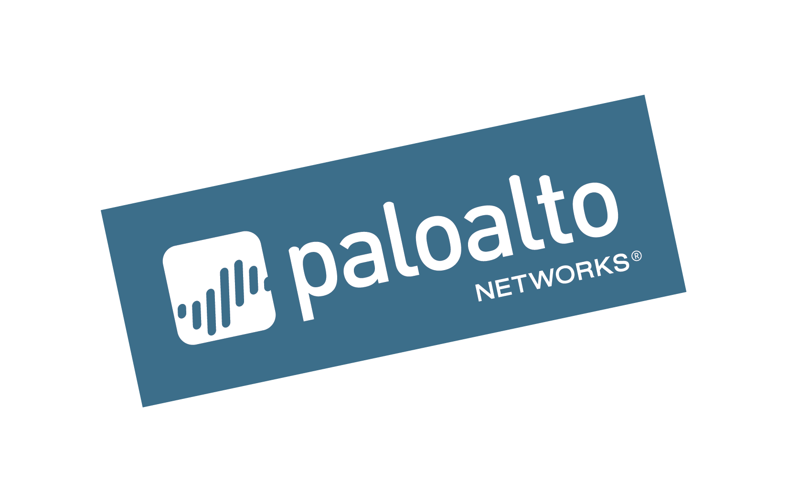

## Introduction

Welcome to the Terraform & Ansible Introduction lab!

In this lab we will deploy a VM-Series firewall in [Google Cloud Platform](https://cloud.google.com) (GCP) using Terraform.  Once deployed, we will then use [Terraform](https://www.terraform.io) and [Ansible](https://www.ansible.com) to manage the configuration of the firewall.  This will include hands-on definition of Terraform plans and Ansible playbooks while exploring the functionality of the Palo Alto Networks Ansible modules and Terraform provider.

The following are NOT goals of this lab:

* __Show a realistic deployment of the firewall:__ More realistic deployment would only complicate the provisioning configuration. If you want to see a more realistic deployment of the firewall in GCP, then please refer to the links at the end of this document for examples.

* __Teach Google Cloud Platform (GCP) functionality:__ The choice to use GCP for this lab was intended to provide exposure to GCP and its command line utilities.  However, a comprehensive overview of GCP is beyond the scope of this lab.  Many of the concept we'll briefly cover are similar to other public cloud providers.

## Requirements

* A laptop with Internet connectivity
* A Google Cloud Platform [account](https://cloud.google.com/free)
* A standards-compliant web browser (Google Chrome recommended)
* Understanding of Linux operating system basics
* Proficiency with a Linux text editor (e.g., vim, nano, or emacs)

## About This Lab
* __Terraform:__ This lab will utilize Terraform for both deploying a VM-Series firewall instances into GCP as well as configuring it once it is deployed.  This will demonstrate the use of the [google](https://www.terraform.io/docs/providers/google/index.html) Terraform provider and its associated resources for the deployment and then the [panos](https://www.terraform.io/docs/providers/panos/index.html) Terraform provider for the configuration of the VM-Series firewall.
* __Ansible:__ Once the firewall is fully configured we will back out all of the configurations made with Terraform and recreate them using the [ansible-pan](https://panwansible.readthedocs.io/en/latest/) modules in Ansible.  This will demonstrate the creation of Ansible playbooks and task definitions.
* __Google Cloud Shell:__ This lab makes use of the Google Cloud Shell instead of deploying a separate VM hosting the Terraform and Ansible packages. Cloud Shell is an interactive shell environment for Google Cloud Platform. It makes it easy for you to manage your projects and resources without having to install the Google Cloud SDK and other tools on a separate host. With Cloud Shell, the Cloud SDK gcloud command-line tool and other utilities you need are always available when you need them.
* __Google Cloud SDK:__ The initial configuration of the lab environment utilizes the Google Cloud SDK command line interface to perform tasks such as enabling APIs and establishing credentials.  These tasks could just as easily be accomplished using the GCP web console.  However, familiarity with the CLI commands is useful and presents opportunities for further scripting and automation.
