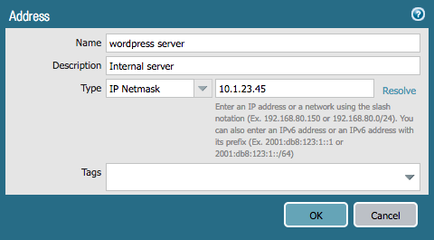
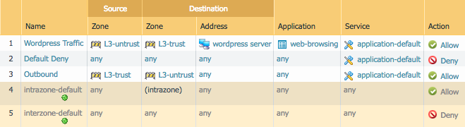

# Terraform Lab

Now that you've going through the [guided example](example-terraform.md),
you're ready to put your Terraform knowledge to use.

Add the following config to your Terraform plan.  As Terraform concatenates
all Terraform files together, you can either place additional config in
new files within the same directory or put everyting in the same file, it
doesn't matter.

[Here is the documentation](https://www.terraform.io/docs/providers/panos/index.html)
for the provider.

* the following address object:
  
  
  
  * [Address object solution](ao-terraform.md)
  
* the following security rules:
  
  
  
  The following fields are common for all security rules:
  
  * **Rule Type** - universal
  * **Source Addresses** - `"any"`
  * **Source users** - `"any"`
  * **HIP Profiles** - `"any"`
  * **URL categories** - `"any"`
  * **Log at session start** - `False`
  * **Log at session end** - `True`
  
  **Note**:  there are multiple resources you can use to accomplish this,
  feel free to use whichever resource you want to use.
  
  * [Security rules solution](sp-terraform.md)
