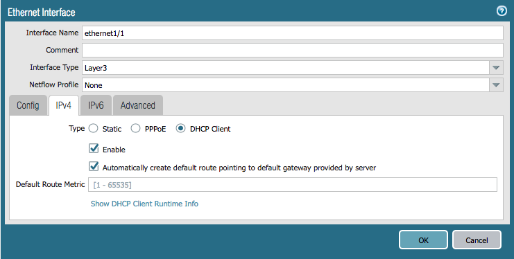
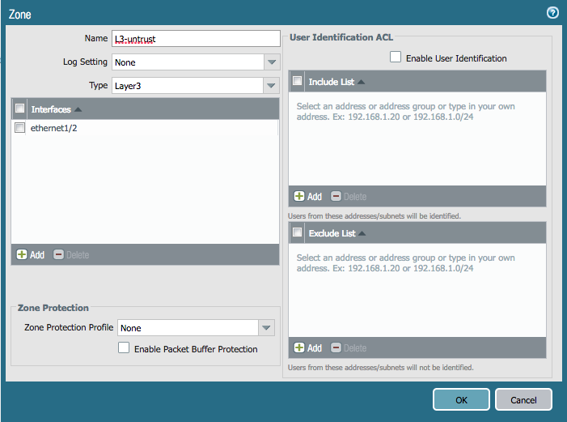
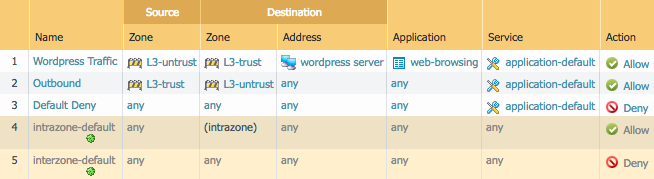

# Terraform Lab Activities

## Task 1 - Basic Networking Config

Create a new empty directory called `terraform-lab` to work in.  We'll use it
for all of our Terraform files.

Open a text editor like **vim**, **emacs**, or **nano** and create the file
`sko2019.tf`.  We will place our Terraform plan in here.

Start by defining the provider config, which will use the `panos` provider.
Replace the IP address used in **hostname** with the address of your lab
firewall, and change the **username** and **password** fields to the values
you have used.

```hcl
provider "panos" {
    hostname = "127.0.0.1"
    username = "admin"
    password = "admin"
}
```

### Network Interfaces

Next, create the interfaces.  Here are screenshots of the interfaces we need to
create:




Add the following configuration to `sko2019.tf`.  Note that the **ethernet1/2**
interface omits the option to create the default route via DHCP.

```hcl
resource "panos_ethernet_interface" "eth1" {
    name = "ethernet1/1"
    vsys = "vsys1"
    mode = "layer3"
    enable_dhcp = true
    create_dhcp_default_route = true
}

resource "panos_ethernet_interface" "eth2" {
    name = "ethernet1/2"
    vsys = "vsys1"
    mode = "layer3"
    enable_dhcp = true
}
```

Refer to the [provider
documentation](https://www.terraform.io/docs/providers/panos/r/ethernet_interface.html)
for ethernet interfaces for more info if you need.

### Zones

Next, create zones for the interfaces we just added.  Here are screenshots of
the zones we need to create:




Add the following configuration to `sko2019.tf`.  The interfaces are referenced
by name, so that Terraform automatically knows that the interfaces need to be
created before the zones themselves.

```hcl
resource "panos_zone" "int" {
    name = "L3-trust"
    mode = "layer3"
    interfaces = ["${panos_ethernet_interface.eth1.name}"]
}

resource "panos_zone" "ext" {
    name = "L3-untrust"
    mode = "layer3"
    interfaces = ["${panos_ethernet_interface.eth2.name}"]
}
```

Refer to the [provider
documentation](https://www.terraform.io/docs/providers/panos/r/zone.html) for
zones if you need.

### Apply the Terraform Plan

Your final, full `sko2019.tf` file should look something like this:

```hcl
provider "panos" {
    hostname = "127.0.0.1"
    username = "admin"
    password = "admin"
}

resource "panos_ethernet_interface" "eth1" {
    name = "ethernet1/1"
    vsys = "vsys1"
    mode = "layer3"
    enable_dhcp = true
    create_dhcp_default_route = true
}

resource "panos_ethernet_interface" "eth2" {
    name = "ethernet1/2"
    vsys = "vsys1"
    mode = "layer3"
    enable_dhcp = true
}

resource "panos_zone" "int" {
    name = "L3-trust"
    mode = "layer3"
    interfaces = ["${panos_ethernet_interface.eth1.name}"]
}

resource "panos_zone" "ext" {
    name = "L3-untrust"
    mode = "layer3"
    interfaces = ["${panos_ethernet_interface.eth2.name}"]
}
```

Let's apply the config to our firewall.  You need to run `terraform init` first
to download all the providers we need, and then check your config with
`terraform plan`:

```bash
$ terraform init
$ terraform plan
```

If there are no errors, go ahead and push your config updates the firewall:

```bash
$ terraform apply
```

Log in to the GUI of your firewall and verify that the configuration matches
what you want.  Note that because of the way Terraform currently functions, the
changes have only been made to the candidate configuration and have **not**
been committed.

---

## Task 2 - Objects and Security Rule Creation

Next, we will create an address object and some security rules.

Here is a screenshot of an address object we need to create:


Add the following to `sko2019.tf`:

```hcl
resource "panos_address_object" "wp" {
    name = "wordpress server"
    description = "Internal server"
    value = "10.1.23.45"
}
```

Refer to the [provider
documentation](https://www.terraform.io/docs/providers/panos/r/address_object.html)
for address objects if you need.

Now, here is a screenshot of security rules that we need to create:



Add the following to `sko2019.tf`.  Just like with the networking config, zones
and objects are referenced by name, so that Terraform knows they need to be
created before our security rules.

```hcl
resource "panos_security_rule_group" "policy" {
    rule {
        name = "Wordpress Traffic"
        source_zones = ["${panos_zone.ext.name}"]
        source_addresses = ["any"]
        source_users = ["any"]
        hip_profiles = ["any"]
        destination_zones = ["${panos_zone.int.name}"]
        destination_addresses = ["any"]
        applications = ["web-browsing"]
        services = ["application-default"]
        categories = ["any"]
        action = "allow"
    }
    rule {
        name = "Outbound"
        source_zones = ["${panos_zone.int.name}"]
        source_addresses = ["any"]
        source_users = ["any"]
        hip_profiles = ["any"]
        destination_zones = ["${panos_zone.ext.name}"]
        destination_addresses = ["any"]
        applications = ["any"]
        services = ["application-default"]
        categories = ["any"]
        action = "allow"
    }
    rule {
        name = "Default Deny"
        source_zones = ["any"]
        source_addresses = ["any"]
        source_users = ["any"]
        hip_profiles = ["any"]
        destination_zones = ["any"]
        destination_addresses = ["any"]
        applications = ["any"]
        services = ["application-default"]
        categories = ["any"]
        action = "deny"
    }
}
```

### Apply the Terraform Plan

Let's apply the config to our firewall.  We don't need to run `terraform init`
again, so just check your config with `terraform plan`:

```bash
$ terraform plan
```

If there are no errors, go ahead and push your config updates the firewall:

```bash
$ terraform apply
```

Log in to the GUI of your firewall and verify that the configuration matches
what you want.  Again, the changes have only been made to the candidate
configuration and have **not** been committed.

---

## Task 3 - Cleanup

Terraform will clean up our config for us with the `terraform destroy` command.
Run it to prepare for the Ansible portion of the lab:

```bash
$ terraform destroy
```

You're done with the Terraform portion of the lab.